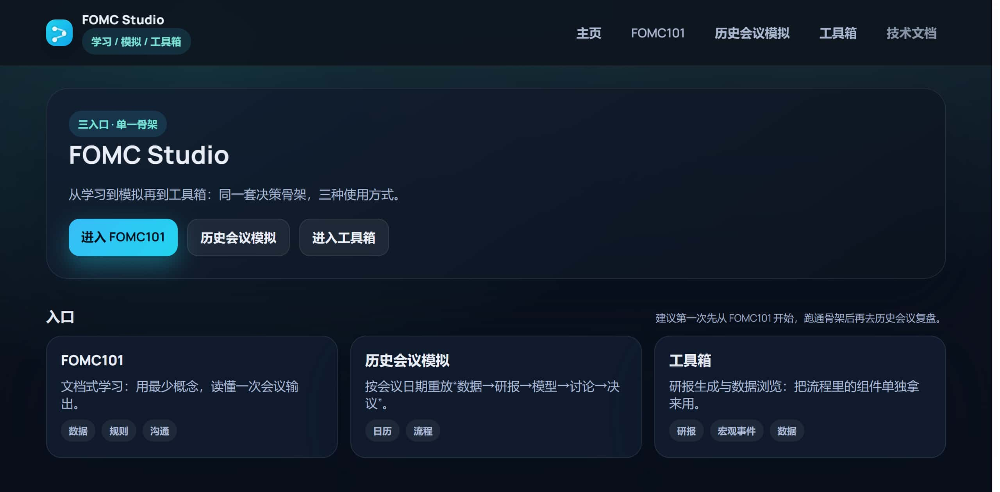
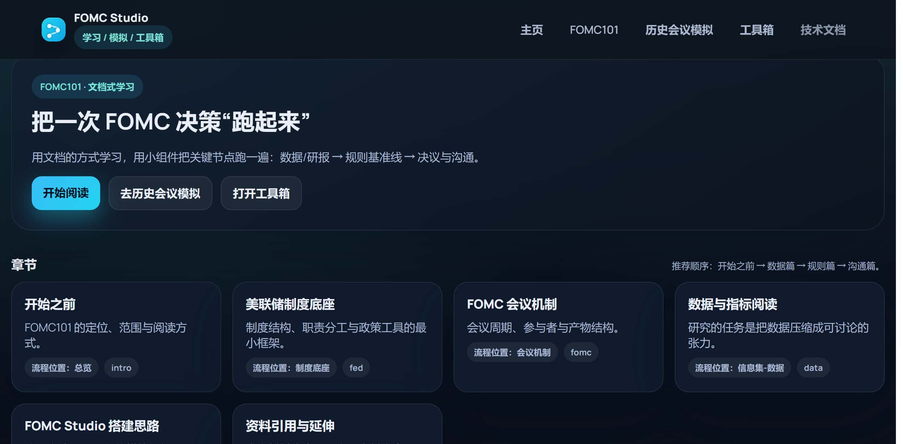
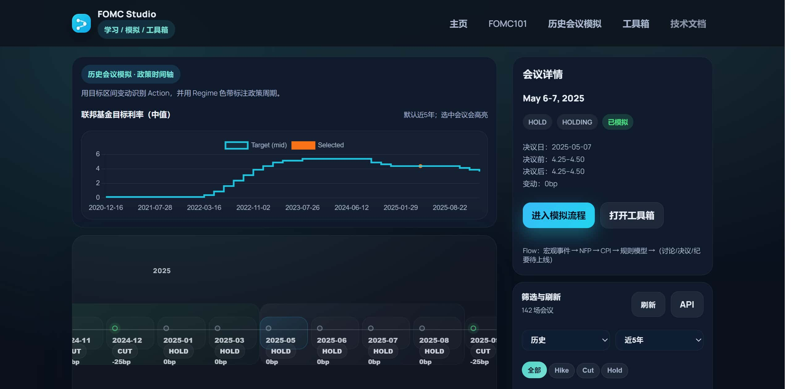
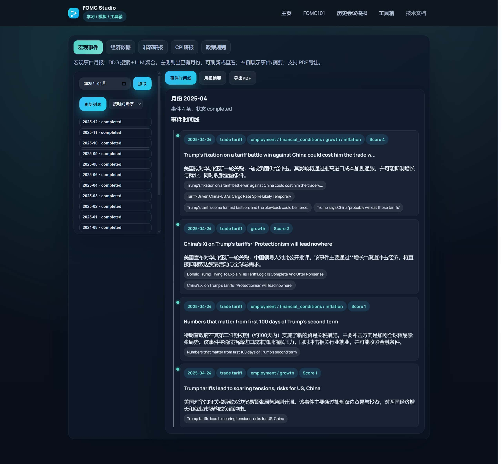
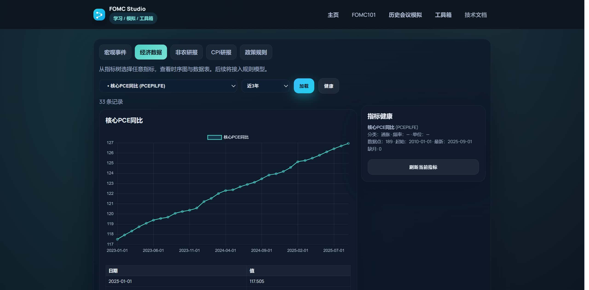
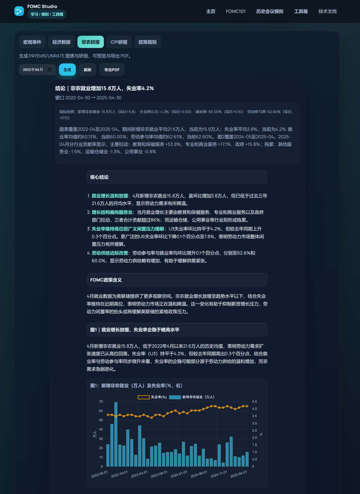
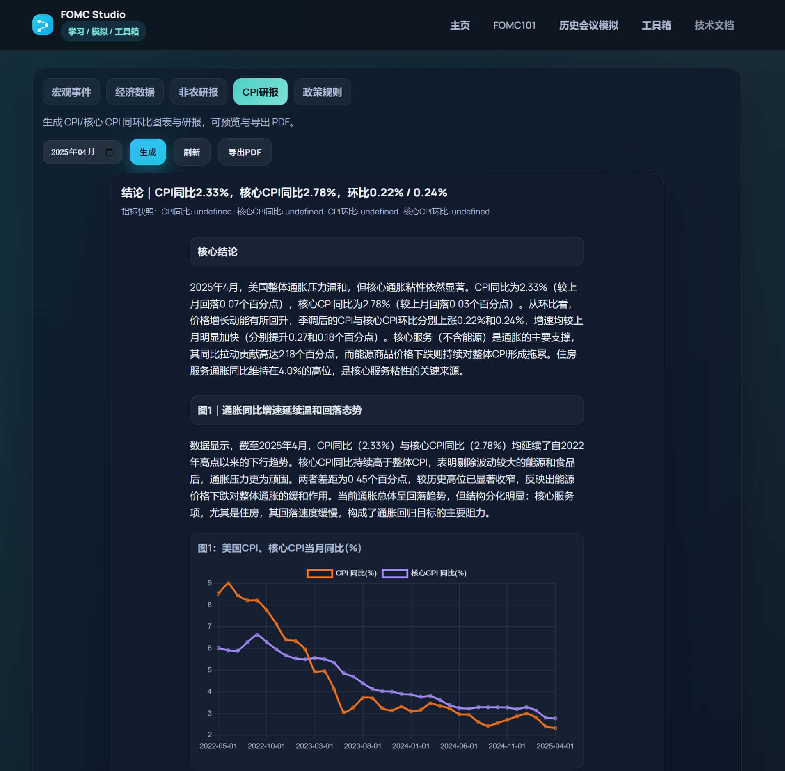
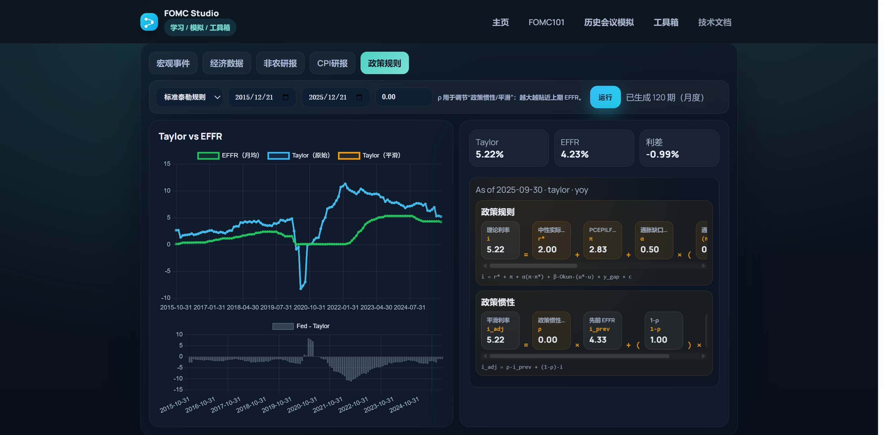

# FOMC Studio（联邦公开市场委员会 · 学习/模拟/工具）


[](https://www.python.org/)
[](https://fastapi.tiangolo.com/)
[](https://www.uvicorn.org/)
[](https://www.sqlalchemy.org/)
[](https://www.sqlite.org/)
[](https://playwright.dev/python/)

FOMC Studio 用同一套底层能力，提供三种入口，帮助用户理解并复现 FOMC 的决策骨架：

- **FOMC101（学习）**：文档式学习 + 可运行小组件（`/fed101`）
- **历史会议模拟（流程）**：按 `meeting_id` 重放会议窗口，生成并缓存材料（`/history`）
- **工具箱（工具）**：把研报、模型、数据浏览拆成独立工具随时调用（`/toolbox`）

快速导航：`/fed101` · `/history` · `/toolbox` · `/techdocs`

## 页面示例图（Screenshots）

**主页**



**FOMC101**



**历史会议模拟**



**宏观事件数据（部分）**



**宏观经济指标浏览器（部分）**



**非农就业研报（部分）**



**CPI 研报（部分）**



**规则模型**



## 你能做什么（功能一览）

- **学习（FOMC101）**：读懂制度底座与会议机制，并用可运行小组件完成数据/规则的“边学边验”
- **流程（历史会议模拟）**：把宏观事件、研报、规则对照、讨论与决议按会议窗口串成可重放流程，并落盘复盘
- **工具（工具箱）**：指标库浏览与同步、宏观事件月报、NFP/CPI 研报、Taylor 规则建模等

## 快速开始（开发者）

```bash
# 1) 安装依赖（建议虚拟环境）
pip install -r requirements.txt

# 2) 以可编辑方式安装包（让 src/fomc 可被导入）
pip install -e .

# 3) 初始化指标数据库（首次运行）
python -m fomc.apps.cli.init_database

# 4) 同步指标数据（需要 FRED_API_KEY）
python -m fomc.apps.cli.process_all_indicators --start-date 2010-01-01

# 5) 启动 Web 门户（http://127.0.0.1:9000）
uvicorn fomc.apps.web.main:app --app-dir src --reload --port 9000

# 可选：若需导出 PDF（研报/宏观月报）
playwright install chromium
```

## 环境变量（.env）

在仓库根目录创建 `.env`：

- `FRED_API_KEY`：同步经济指标所需（没有它也能启动门户，但图表/模型可能无数据）
- `DEEPSEEK_API_KEY`：使用 LLM 能力所需（宏观事件摘要、会议讨论/投票、Statement/Minutes 生成等）

LLM 相关可选配置：`DEEPSEEK_BASE_URL`、`DEEPSEEK_MODEL`、`DEEPSEEK_TIMEOUT`、`DEEPSEEK_RETRIES`（见 `src/fomc/infra/llm.py`）。

提示：LLM 调用需要联网与 API Key，可能产生费用；若未配置 `DEEPSEEK_API_KEY`，部分生成链路会降级或不可用。

## 使用路径（启动后）

- 主页：`http://127.0.0.1:9000/`
- FOMC101：`http://127.0.0.1:9000/fed101`
- 历史会议模拟：`http://127.0.0.1:9000/history`
- 工具箱：`http://127.0.0.1:9000/toolbox`
- 技术文档（TechDocs）：`http://127.0.0.1:9000/techdocs`

推荐第一次体验顺序：

1. 打开 `/history` 选择一个会议（`meeting_id`）
2. 进入 `/history/<meeting_id>/overview` 生成并缓存材料
3. 依次浏览：`macro → nfp → cpi → model → discussion → decision`
4. 回到 `/fed101`，用学习章节对照理解每一步的输入/输出与假设

## 数据与缓存落点

- 指标数据库：`data/fomc_data.db`（见 `src/fomc/config/paths.py`）
- 宏观事件库：`data/macro_events.db`
- 研报文本缓存：`data/reports.db`
- 历史会议产物缓存：`data/meeting_runs/<meeting_id>/`
  - 读写封装：`src/fomc/data/meetings/run_store.py`
  - 典型产物：宏观摘要、NFP/CPI 研报、规则模型结果、讨论过程、Statement/Minutes 生成稿等
- Prompt 运行日志：`data/prompt_runs/`

## 内容与技术文档（哪里看/改）

- FOMC101 内容：`content/fed101/`（Markdown + `fomc-cell`）
- TechDocs 内容：`content/techdocs/`（以当前实现为准；推荐从 `/techdocs/intro` 开始读）
- Prompt 模板：`content/prompts/`
  - 研报：`content/prompts/reports/`
  - 会议讨论：`content/prompts/meetings/`

## 仓库结构（代码）

- `src/fomc/apps/web/`：FastAPI + Jinja 门户（页面路由、模板、静态资源）
- `src/fomc/apps/web/backend.py`：门户集成层（把数据/研报/模型/LLM 串起来）
- `src/fomc/apps/flaskapp/`：研报生成与 PDF 导出（工具箱/历史会议复用）
- `src/fomc/data/`：指标库、宏观事件、会议日历与落盘缓存
- `src/fomc/reports/`：研报生成（NFP/CPI）
- `src/fomc/rules/`、`src/fomc/data/modeling/`：规则模型（Taylor 系列）
