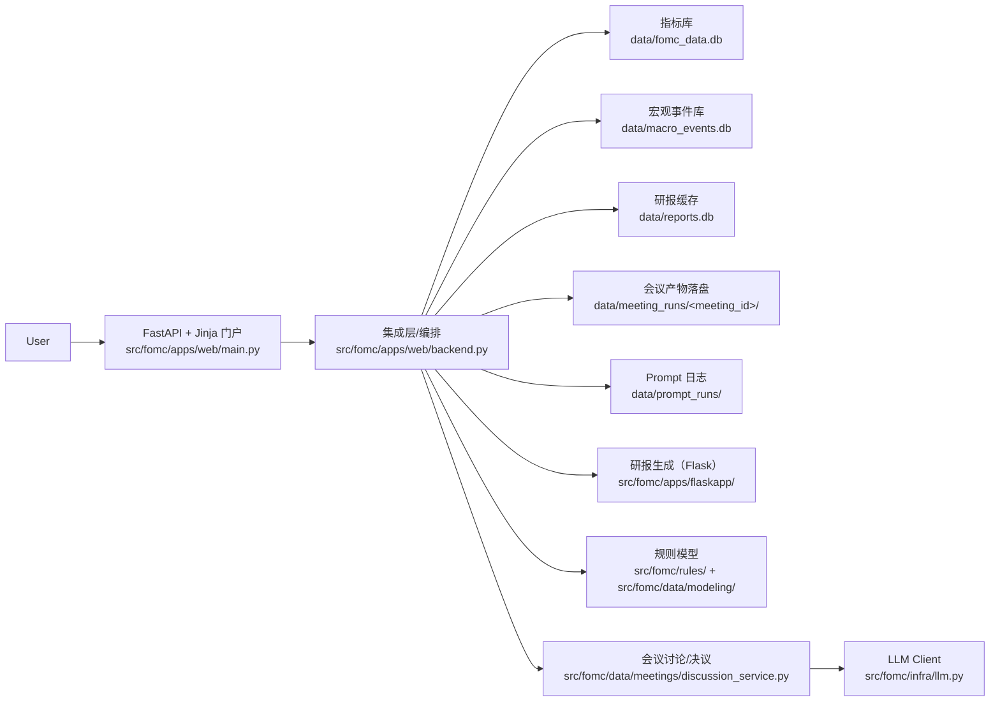

# 架构

> 本页描述**当前实现**（What is），不是 `docs/development.md` 里的目标蓝图（What should be）。

## 总体结构：一套能力，三种入口

三种入口共享同一套底层模块：

- 学习：`/fed101`（文档 + 可运行 cell）
- 流程：`/history`（按会议串联、生成并落盘）
- 工具：`/toolbox`（把能力拆成独立工具）

## 一张图（快速理解）

> 说明：TechDocs 页面对 Mermaid 不做渲染（会以代码块展示）。如果你想在页面里展示成图，可以把 Mermaid 渲染为 PNG 放入静态资源。

## 运行拓扑（当前实现）

- **Web 门户**：`src/fomc/apps/web/main.py`（FastAPI + Jinja）
- **集成层**：`src/fomc/apps/web/backend.py`（串联数据/研报/模型/LLM）
- **研报后端**：`src/fomc/apps/flaskapp/app.py`（图表 + LLM 研报 + PDF 导出）
- **数据模块**：`src/fomc/data/**`（指标库、宏观事件、会议材料）
- **规则模型**：`src/fomc/rules/` + `src/fomc/data/modeling/`

说明：研报模块当前仍由 Flask 实现，门户侧通过集成层调用，保证工具箱/历史会议/FOMC101 共用同一套研报输出。

## 数据与一致性策略（从输入到落盘）

1) 数据与上下文

- 指标时间序列：`data/fomc_data.db`
- 宏观事件：`data/macro_events.db`
- 研报文本缓存：`data/reports.db`
- 会议上下文：`meeting_id -> report_months`（`backend.py:get_meeting_context`）

2) 生成与计算

- NFP/CPI 研报：`flaskapp/app.py` 生成 -> `backend.py` 封装
- 规则模型：`taylor_service.py` + `taylor_rule.py`
- 讨论与决议：`data/meetings/discussion_service.py`

3) 缓存与落盘

- 会议产物：`data/meeting_runs/<meeting_id>/`（统一由 `manifest.json` 维护清单）
- Prompt 运行日志：`data/prompt_runs/`（研报、宏观月报、会议讨论）

设计取舍：

- **优先可复盘**：会议级产物写文件落盘，避免“只在内存里跑完”导致无法复现
- **优先可重放**：同一个 `meeting_id` 的产物可以按 `cached/refresh` 规则重复生成或复用
- **优先可追溯**：所有 LLM 调用写入 `data/prompt_runs/`，便于回放输入与输出

## 典型请求路径（举例）

- **历史会议材料（宏观）**
  - `GET /api/history/{meeting_id}/materials/macro`
  - `backend.ensure_meeting_macro_md` -> 宏观事件月报 -> 会议级摘要 -> 落盘（`data/meeting_runs/<meeting_id>/macro.md`）

- **研报（CPI）**
  - `GET /api/reports/cpi` -> `backend.generate_cpi_report`
  - 内部调用 `flaskapp/app.py` 生成图表与文本，写入 `reports.db`

- **规则模型**
  - `POST /api/models/taylor` -> `taylor_service.build_taylor_series_from_db`

## 你排查问题时的最短路径

1. 从 `main.py` 找到路由
2. 跳到 `backend.py` 找编排逻辑
3. 再进入对应的 data/reports/rules 模块
4. 查看 `data/` 下的落盘目录与 SQLite
